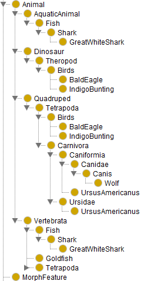

# Animal Image Recognition Challenge

## About the project

The objective of this project is to create an animal image recognition model using supervised learning. To do so, we have at our disposal annoted images from the ImageNet Database, available for a [Kaggle challenge](https://www.kaggle.com/competitions/imagenet-object-localization-challenge/).  
The chosen approach to accomplish this objective is to build an ontology of all the animals and their morphological features by extracting data from WikiData, and then train the model on the ontology.  
This project is a [UTBM](https://www.utbm.fr/) student project realized as a part of the UV [DS51](https://guideuv.utbm.fr/#!/Fr/2022/GI/DS51).

## Getting Started

The project is fully written in python. Here are the modules to install :
- SPARQLWrapper
- nltk (with WordNet version 3.1 or higher)
- tqdm
- pandas
- xmltodict
- rdflib  

We organized the project as a pipeline generating the image recognition model step by step. The input of the pipeline is a file containing a list of synsets mapped to their ImageNet ID. By default, there are 2 different pipeline inputs:
1. [All of the synsets from the Kaggle challenge](https://www.kaggle.com/competitions/imagenet-object-localization-challenge/data?select=LOC_synset_mapping.txt) 
1. A selection of 6 synsets, used as a proof of concept (POC) of the project   

To run the pipeline on the POC synsets, execute the `main.py` file. As executing the pipeline generates a lot of calls to the WikiData API per synset, running it on all of the Kaggle challenge synsets at once won't be possible for API limitations reasons. Therefore, on the full dataset, the pipeline needs to run step by step, some steps multiple times, and digging into the code is inevitable. As an improvement of this project, a command line interface would prevent that need.  

The input of the pipeline is a file named [LOC_synset_mapping.txt](https://github.com/Molrn/animal-image-ontology/blob/main/Data/KaggleChallenge/LOC_synset_mapping.txt). When running the pipeline, the following files are generated:
- [synset_mapping.json](https://github.com/Molrn/animal-image-ontology/blob/main/Data/KaggleChallenge/synset_mapping.json)
- [graph_arcs.csv](https://github.com/Molrn/animal-image-ontology/blob/main/Data/KaggleChallenge/graph_arcs.csv)
- [animal_features.json](https://github.com/Molrn/animal-image-ontology/blob/main/Data/KaggleChallenge/animal_features.json)
- `animal_ontology.ttl`

The ontology file isn't in the repository, but it can easily be generated from the 3 first files. If you want to rerun a specific step of the pipeline, delete the file it generates and run the function of the step. 

## Pipeline description

This description of this pipeline is focused on how the pipeline works, and not on how it was implemented or which function represents which step. If you are interested by that, check the `full_commented_pipeline` function in the [main.py](https://github.com/Molrn/animal-image-ontology/blob/main/main.py) file. 

### Synset WikiData mapping

In order to build an ontology based on data from WikiData, we first have to find the entities in WikiData that match each one of our synsets. To do so automatically, there are 2 WikiData properties which can be used:
1. `Exact match` ([P2888](https://www.wikidata.org/wiki/Property:P2888))  
1. `WordNet 3.1 Synset ID` ([P8814](https://www.wikidata.org/wiki/Property:P8814))

The main issue of this step is that the synset ID that we have is outdated in WikiData since 2011, and the release of the version 3.1 of WordNet, in which all of the synset IDs were modified. For more clarity, from now on, we will call the older (3.0 and lower) WordNet ID `ImageNet ID` (or `inid`) and the WordNet 3.1 ID `WordNet ID` (or `wnid`). WikiData ID will also be refered to as `wdid`.  

The `exact match` property still contains some ImageNet ID, but it doesn't even represent half of the Kaggle Challenge synsets. Therefore, the first step is to find the WordNet ID of all of our synsets. As WordNet can be installed as a python module from the `Natural Language ToolKit` (nltk), and as synsets weren't modified from version 3.0 to 3.1 (only their IDs), synsets can be directly looked up there.  By default, `nltk` comes with an older version of WordNet, therefore the [3.1 WordNet database](https://wordnet.princeton.edu/download/current-version) has to be downloaded separately and replaced in the `nltk` WordNet files.  

Once this mapping is done, there still are over 200 synsets without WikiData match. Therefore, for these ones, a user controlled mapping takes place. The lemmas of the synsets are searched in the WikiData labels and aliases and the description of each match is displayed to the user, which allows him to select the best match.  

The last part of this step is to remap the entities that are common names of other entities (`p:P31/pq:P642` property) and aren't linked to any parent entity. In those cases, the `common name of` property is the only link of the object to other WikiData entities, and in SPARQL, going through the property before doing the required query times out every time.  

The result of the mapping is stored as a list of dictionnaries in a JSON file named [synset_mapping.json](https://github.com/Molrn/animal-image-ontology/blob/main/Data/KaggleChallenge/synset_mapping.json). Each synset dictionnary looks this way:
```json
{
    "inid": "n02114367",
    "wnid": "02117019-n",
    "synset": [
        "timber wolf",
        "grey wolf",
        "gray wolf",
        "Canis lupus"
    ],
    "wdid": "Q18498"
}
```
### Build an Animal graph structure

The objective of this step is to extract from WikiData a tree structure with as root the [Animal entity](https://www.wikidata.org/wiki/Q729) and as leaves the WikiData entities of our synsets. Intermediate nodes of the graph will be obtained by going through the WikiData properties subClassOf ([P279](https://www.wikidata.org/wiki/Property:P279)), instanceOf ([P31](https://www.wikidata.org/wiki/Property:P31)) and parentTaxon ([P171](https://www.wikidata.org/wiki/Property:P171)).  

We started by identifying for every WikiData entity in our dataset, if it exists, the pattern of properties to go from the entity to the animal entity. The last step allowed us to connect 383 animals of the Kaggle challenge dataset to their WikiData entity. These animals have 4 different patterns to the animal entity:
1. `subclass` (wdt:P279* wd:Q729): recursive animal sub-class (75 animals, mostly dog breeds)
1. `taxon` (wdt:P171* wd:Q729): recursive animal sub-taxon (245 animals)
1. `subclass_instance` (wdt:P31 [wdt:P279* wd:Q729]): instance of a recursive animal sub-class (56 dog breeds, 1 rabbit breed)
1. `subclass_taxon_subclass` (wdt:P279 [ wdt:P171* [wdt:P279* wd:Q729]]): sub-class of a class taxon recursively linked to a recursive animal sub-class (6 animals)
1. `None`: entities with no animal pattern can then be considered as not animals

These patterns are saved as new values in the dictionnaries of the file [synset_mapping.json](https://github.com/Molrn/animal-image-ontology/blob/main/Data/KaggleChallenge/synset_mapping.json). To build the graph, it also is required to add the label of each entity. Indeed, in order to clarify the graph, the labels of the entities are used to identify them instead of their WikiData ID. The final of each synset dictionnary is then the following (its final form):
```json
{
    "inid": "n02114367",
    "wnid": "02117019-n",
    "synset": [
        "timber wolf",
        "grey wolf",
        "gray wolf",
        "Canis lupus"
    ],
    "wdid": "Q18498",
    "label": "Wolf",
    "animal_pattern": "taxon"
}
```
From these animal patterns, we can now deduce the path to the animal entity for each animal. If building the graph is pretty straight forward for animal the `subclass` and `subclass_instance` patterns (every intermediate parent class becomes a node in the graph), it becomes trickier for `taxon` and `subclass_taxon_subclass` patterns. Indeed, the taxon path is much more complex, and putting all of the parent taxons as nodes of the graph produces a very messy graph. 

Some of the taxon parents actually are also subclasses of the animal entity. Therefore, the first solution for this problem was to identify the nodes in both graphs and and add them to our graph. The problem of this solution is that it doesn't take into account a lot of important classes, and that a lot of animals end up being only tied to the animal entity in our graph. For example, the [Birds entity](https://www.wikidata.org/wiki/Q5113) was never detected, as it is a subclass of [Vertebrata](https://www.wikidata.org/wiki/Q25241) which isn't directly a subclass of Animal, as it is its common name entity, [Vertebrate](https://www.wikidata.org/wiki/Q110551902), which is a subclass of Animal.

The final solution was to take into account all of the entities in the parent taxon path which have a parent class, with the condition that this parent class is still connected to the animal entity via a taxon path.  

Here is the generated graph on the POC dataset, in which all of the 6 synsets have a `taxon` animal pattern: 
")
As you can see, all of the entities find a logical path to the animal class, except the entity [goldfish](https://www.wikidata.org/wiki/Q123141), who only finds its way to the vertebrate entity. It still is a much more than acceptable result. 

The graph is saved in a CSV file named [graph_arcs.csv](https://github.com/Molrn/animal-image-ontology/blob/main/Data/KaggleChallenge/graph_arcs.csv) as a list of parent/child couple of nodes, including the label of each node. This list represents the arcs of the graph. The ontology will be built on this graph structure, using the labels as node ID.

### Ontology creation

#### Ontology structure

The structure of the ontology is composed of 2 main parts: the subclass graph structure and the definition of the morphological features. From the [graph_arcs.csv](https://github.com/Molrn/animal-image-ontology/blob/main/Data/KaggleChallenge/graph_arcs.csv) file, the first part is pretty straight forward. For each node of the graph, a new class is created with the label of the entity as identifier. Then, for each arc, a triplet (`child rdfs:subClassOf parent`) is created. After the creation of all the arcs, the integrity of each subclass triplet is checked. If the parent of the triplet is also a parent of another class of the child, the triplet is removed. Each class also gets attributed their WikiData ID, and for those which have one, their ImageNet ID.     

There is no kind of morphological features in WikiData. Therefore, the morphological features have to be initialized in another way. All of them are listed in a JSON file named [animal_features.json](https://github.com/Molrn/animal-image-ontology/blob/main/Data/KaggleChallenge/animal_features.json), in which the animal labels are the keys and the features of the animals are the values in a list of string. Here is an extract of this file for the wolf class and its parent classes:
```json
{
    "Vertebrata": ["Backbone", "Spinal cord"],
    "Quadruped": ["Four legs"],
    "Tetrapoda": ["Four limbs", "Lungs"],
    "Carnivora": ["Sharp teeth", "Claws"],
    "Caniformia": ["Dog-like shape"],
    "Canidae": ["Muzzle", "Pointed ears"],
    "Canis": ["Pointed snout", "Sharp teeth"],
    "Wolf": ["Canine teeth", "Bushy tail"]
}
```
If this file can be filled manually, we chose to use [ChatGPT](https://chat.openai.com/) to generate it. The print we used was the following:
```
For all the following animal categories, give a list of morphological features that represent it. Each feature has to be one word :  
    Vertebrata : 
    Quadruped : 
    Tetrapoda : 
    Carnivora : 
    Caniformia : 
    Canidae : 
    Canis : 
    Wolf :   

Some of these aren't morphological. Focus only on morphological features
```  
It is more and more common to see supervised learning models trained with AI generated content, and in our case it seems like a good way to proceed.  

All of the features are then defined as instances of a class `MorphFeature`, and added as features of the matching class and all of its subclasses. For example, here is the generated definition of the Wolf class: 
```Turtle
ac:Wolf a rdfs:Class ;
    ac:hasMorphFeature ac:backbone,
        ac:bushyTail,
        ac:canineTeeth,
        ac:claws,
        ac:dogLikeShape,
        ac:fourLegs,
        ac:fourLimbs,
        ac:lungs,
        ac:muzzle,
        ac:pointedEars,
        ac:pointedSnout,
        ac:sharpTeeth,
        ac:spinalCord ;
    ac:inid "n02114367" ;
    ac:wdid wd:Q18498 ;
    rdfs:subClassOf ac:Canis .
```
This step could be majorly improved, especially by creating sub-classes of the `MorphFeature` class, correspunding to different parts of the body (furr, mouth, legs, ears, tail, etc...) and instances of these classes being a specific feature of this part of the body (size, color, etc...). This would most likely be a huge help for the supervised learning model, but with a large amount of classes, it would be much harder to match the features to the animals.  

Once the ontology structure is generated, it is possible to visualize it using ontology editing tools, like [Protégé](https://protege.stanford.edu/).  



#### Ontology population

Now that the ontology structure is created, to finalize its creation, it needs to be populated. The population is made of individual animals which appear on images from the ImageNet database. As explained earlier, a part of this database has been made public for a [Kaggle challenge](https://www.kaggle.com/competitions/imagenet-object-localization-challenge/).  

Populating the ontology starts by downloading the images dataset. To do so:  
1. Log in to [Kaggle](https://www.kaggle.com/account/login)
1. Go to the [challenge rules page](https://www.kaggle.com/competitions/imagenet-object-localization-challenge/rules) and accept the rules
1. Go to [your account page](https://www.kaggle.com/settings/account) and generate an API token
1. Place the generated kaggle.json file in the directory of the project
1. execute this command: `kaggle competitions download -c imagenet-object-localization-challenge`  
    
Once the zip file is downloaded, the program unzips the resources of the animals in the ontology, and splits the resources into a testing and a training dataset. The ontology will be populated with the training dataset, while the testing one will be used to evaluate the performances of the model. Considering the amount of resources available, 1% of the resources being used for testing is considered to be enough.  

The downloaded dataset contains two kinds of resources: images and annotations. Annotations are XML files that detail the content and properties of an image. Not all images are annoted. The relevant features of the annotation files are: 
- The size (width, height) of the image
- a list of entities in the images. 

Each entity is an animal of the class present on the image. Each object contains a bounding box, which is a list of 4 integers (xmin, ymin, xmax, ymax) which represent the rectangle (in pixels) in which the animal appears on the image.  

Here is how the images and animal instances are represented in the ontology:
```Turtle
ac:n02114367_10043 a ac:Wolf ;
    ac:boundingBox [ ac:xMax 350 ;
            ac:xMin 4 ;
            ac:yMax 276 ;
            ac:yMin 82 ] ;
    foaf:img ac:IMG_n02114367_10043 .

ac:IMG_n02114367_10043 a schema:ImageObject ;
    schema1:image [ a schema:URL ;
            schema:value <file:///{project_path}/Data/Images/Train/n02114367/n02114367_10043.JPEG> ] ;
    ac:size [ ac:height 347 ; 
            ac:width 500 ] .
```

An instance of the animal class is created per object in the declared in the Annotations file. It has as property the image on which it appears and (if an annotation file exists for the image) the bounding box in which it appears. The image is defined as an instance of the class [schema:ImageObject](https://schema.org/ImageObject) having as parameters the absolute path of the file and (if the image is annoted) its size in pixels.  

As the images aren't available online resources, the populated ontology isn't easily sharable, which is why it isn't available in this repository. Once created, the ontology is saved into a file named `animal_ontology.ttl`.
